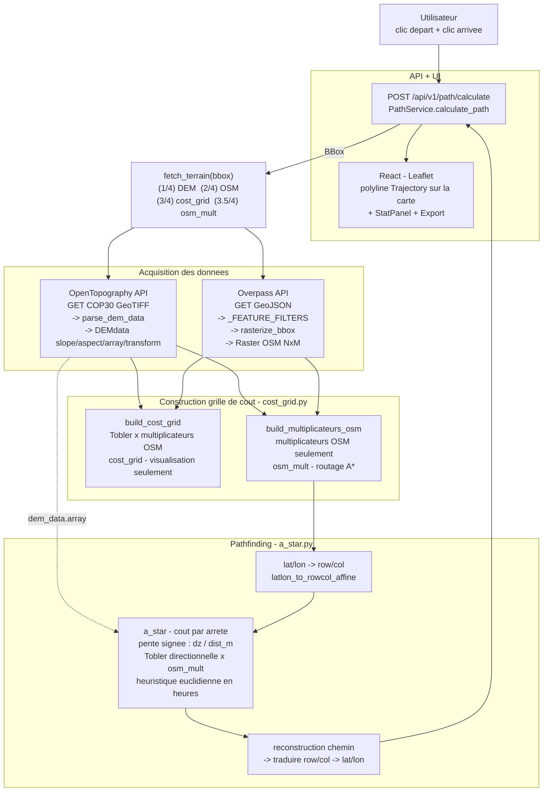
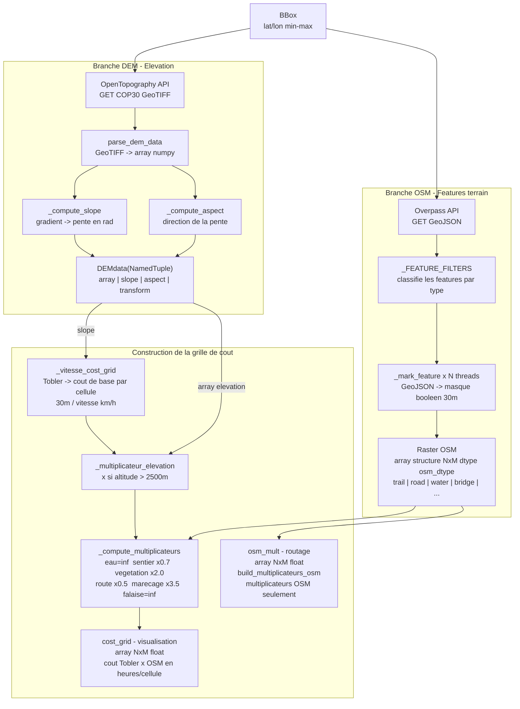
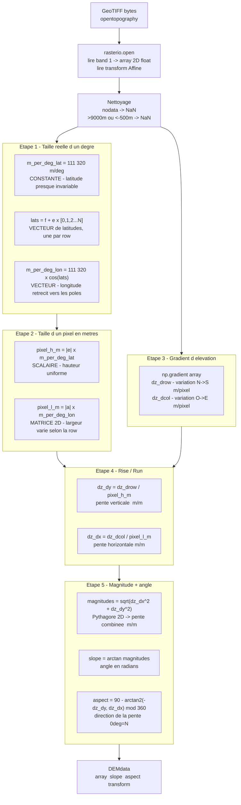
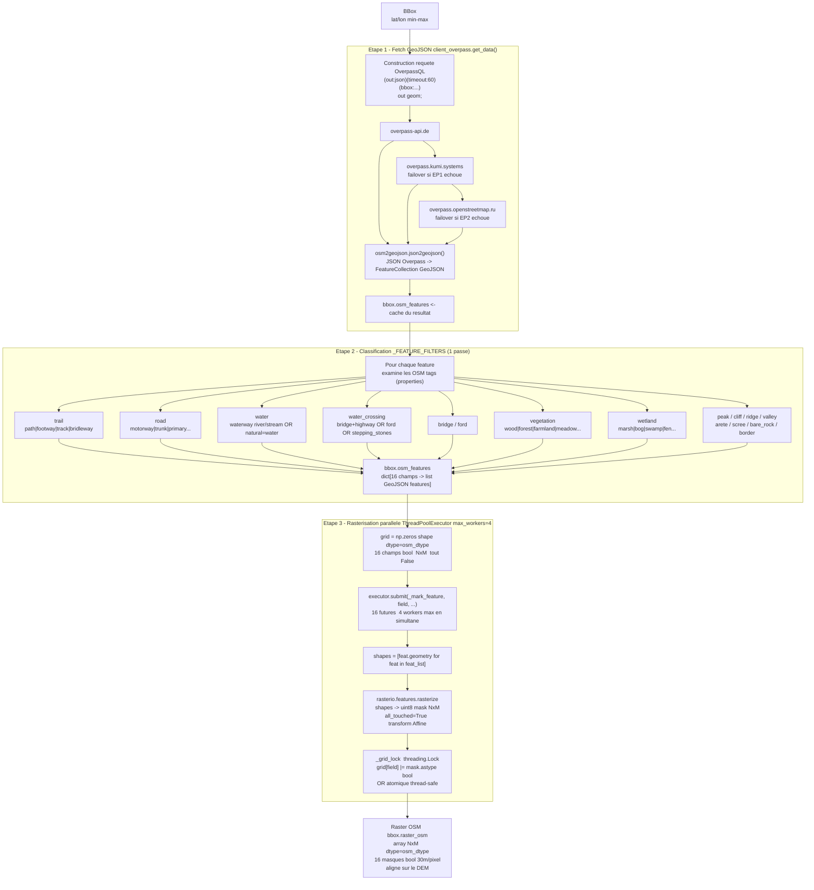
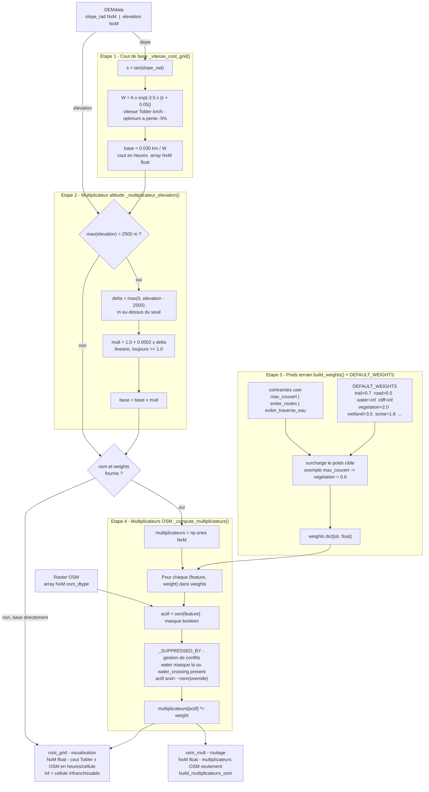
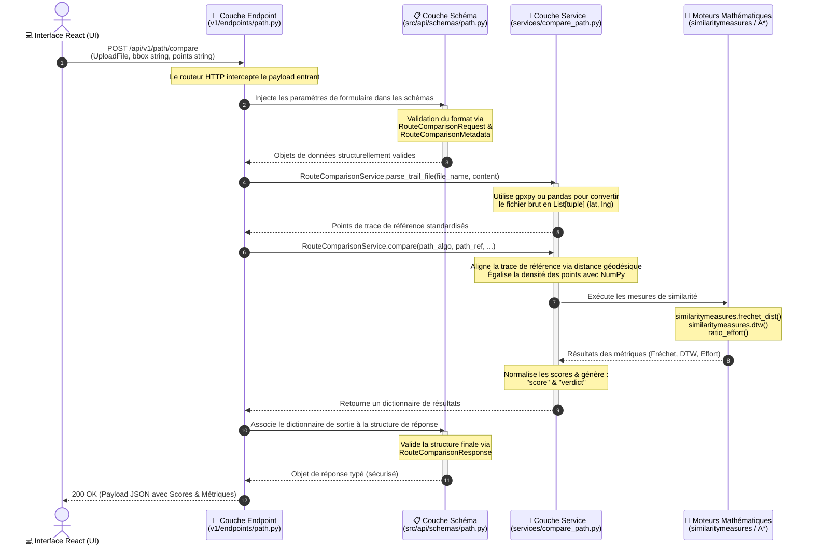
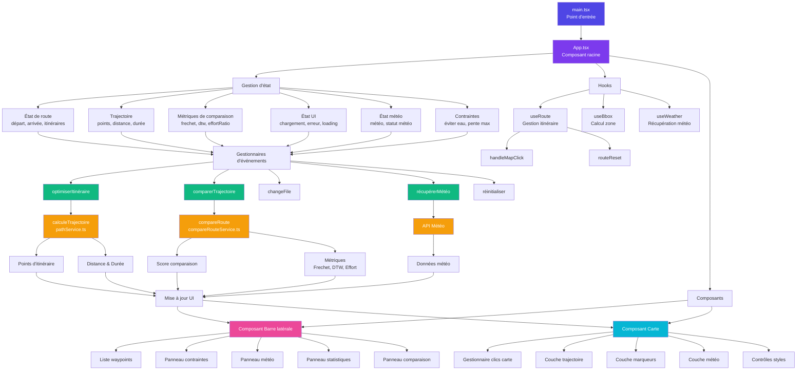

# Pipeline complet - Projet Condor

# Pipeline de donnees - Projet Condor

# Parsing des donnees d'elevation - parser_elevation.py

# Rasterisation Overpass - raster_overpass.py

# Construction de la grille de cout - cost_grid.py + weights.py

# Pipeline API - exemple  avec compare call 

# Pipeline Pathfinding - Projet Condor
# Pipeline UI/UX - Projet Condor
# Pipeline UI Condor

## Résumé du pipeline UI

**Point d'entrée** → `main.tsx` initialise React et affiche `App.tsx`

**Couche état** → `App.tsx` gère :
- État de route (points de départ/arrivée)
- Données de trajectoire (points, distance, durée)
- Métriques de comparaison (Frechet, DTW, ratio d'effort)
- Météo et contraintes
- États de chargement/erreur UI

**Couche hooks** → Logique réutilisable :
- `useRoute` - gère la sélection d'itinéraire
- `useBbox` - calcule la zone délimitée
- `useWeather` - récupère les données météo

**Couche composants** → Deux conteneurs principaux :
- **Barre latérale** - contrôles UI, statistiques, comparaisons
- **Carte** - carte interactive avec couches

**Gestionnaires d'événements** → Déclenchés par actions utilisateur :
- Optimisation itinéraire → appel API → mise à jour points
- Comparaison trajectoire → appel API → mise à jour métriques
- Récupération météo → appel API → mise à jour couche
- Réinitialisation → efface tous les états

**Couche API** → Services backend :
- `pathService.ts` - calcul d'itinéraire
- `compareRouteService.ts` - comparaison de trajectoire
- API Météo - données météorologiques

**Affichage** → L'état mis à jour revient aux composants pour l'actualisation UI

