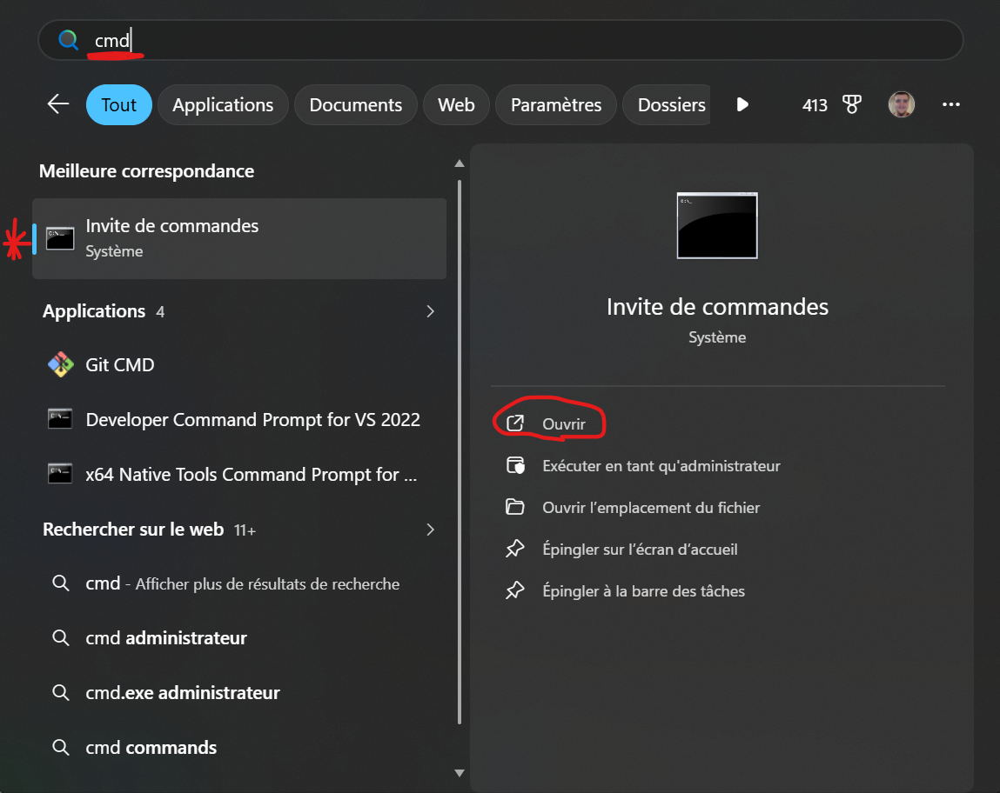
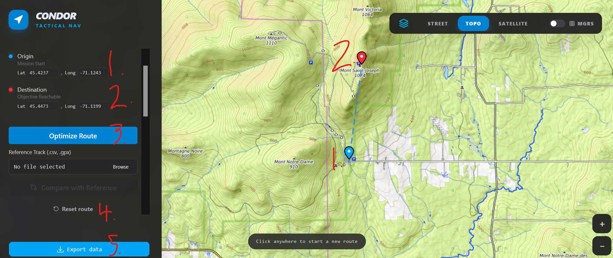
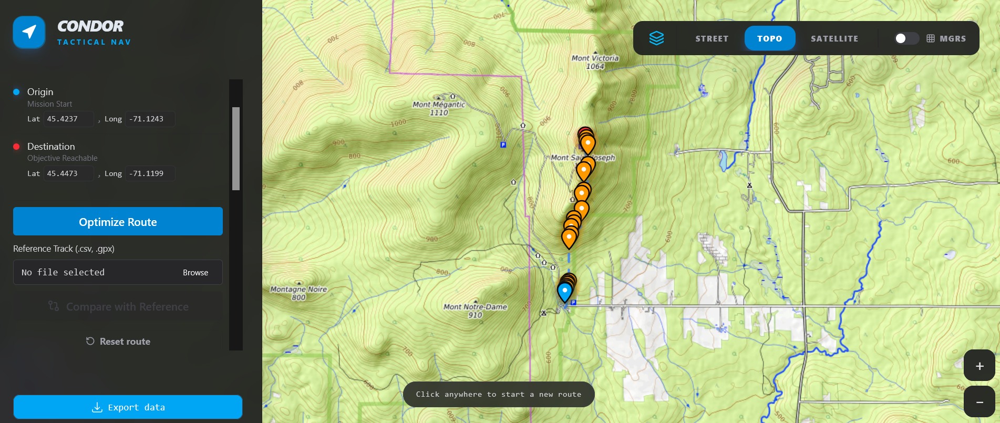
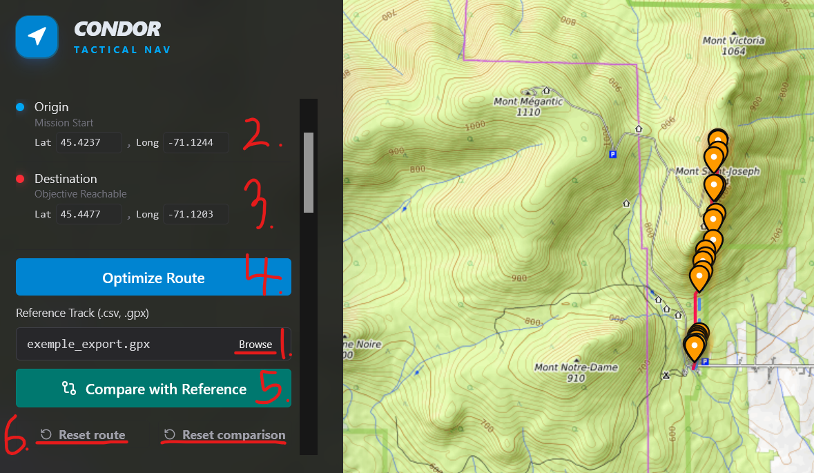
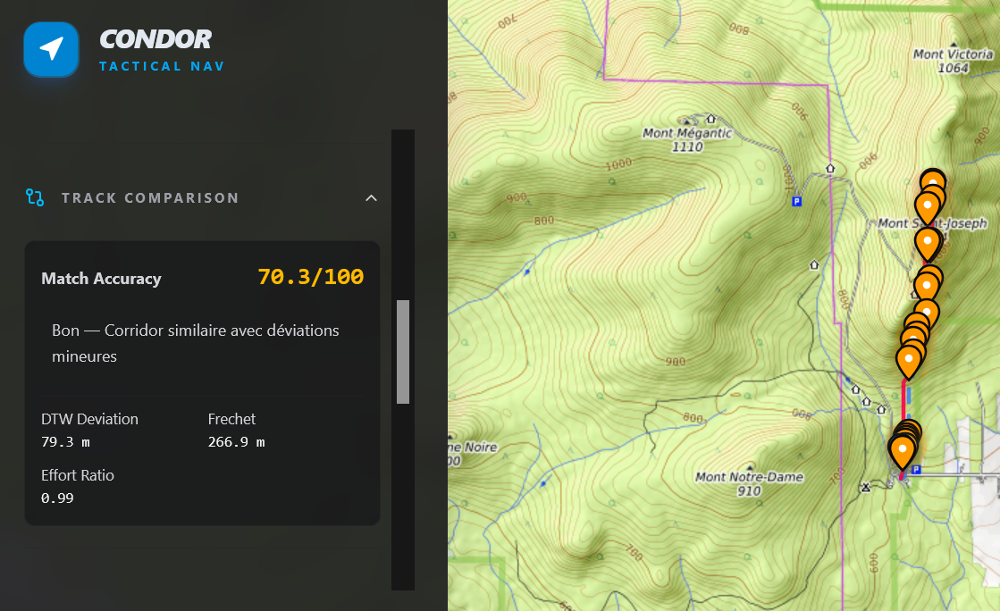
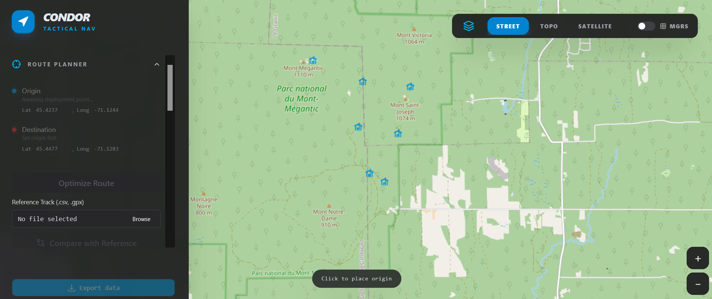
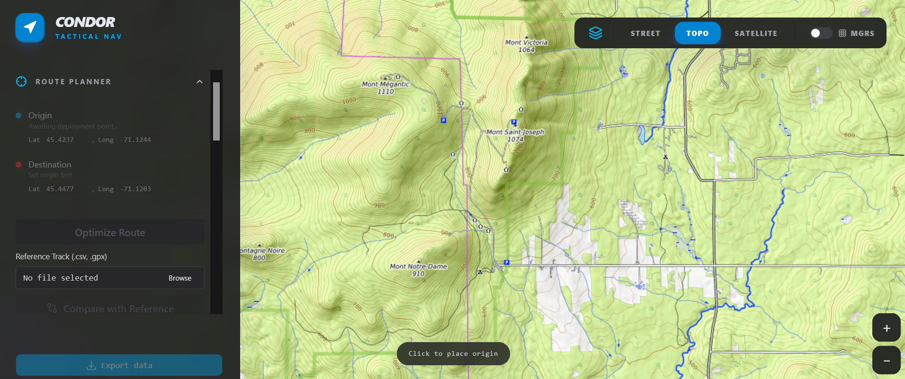
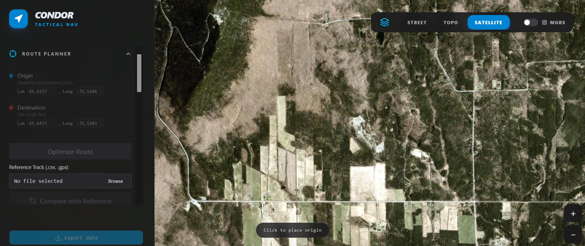
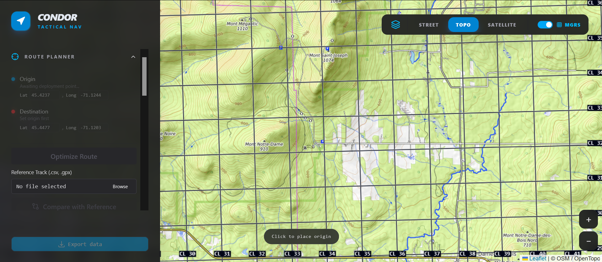

# Projet Condor
Un planificateur d'itinéraire en terrain isolé/non balisé


## Contexte
L’avènement des outils moderne de navigation tels que AllTrails, Strava et Garmin ont largement participé à la démocratisation de l’accès au plein air en offrant une alternative à l’utilisation d’une carte et boussole ou l’achat d’un GPS dispendieux et complexe a utiliser. 

Cependant, ces outils présentent des limitations importantes dans certains cas particuliers. Leur implémentation repose habituellement sur des graphes construit uniquement à partir d’infrastructures existantes et souvent fréquentées par d’autres utilisateurs(routes, sentiers, voie cycliste…etc). Cette caractéristique les rend peu adaptées à des contextes où de telles infrastructures sont absentes, incomplète ou volontairement ignorées. Par exemple, la planification d’un itinéraire en terrain complexe et isolé, la nécessité d’éviter certaines infrastructure (routes, frontières, cours d’eau) ou encore l’optimisation selon certains critères environnementaux (maximiser le couvert des arbres ou de suivre un certain cour d’eau) constituent des cas d’usage mal supportés par les outils disponible actuellement.

En parallèle, l’accès à l’information géospatiale s’est grandement facilité dans les dernières années. Des sources ouvertes telles que OpenStreetMap ainsi que des portails gouvernementaux offrent des données détaillées et variées pouvant servir à modéliser le territoire (Topographie, Hydrographie, couverture végétale…etc) souvent disponible en format exploitable et lisible comme GeoJSON

Dans ce contexte, ce projet vise à implémenter un programme permettant d’exploiter ces données afin de proposer un prototype permettant de répondre à plusieurs ou toutes les limitations identifiées plus haut.


### Prérequis
- Python 3.10+
- Node.js 18+

Pour que le projet fonctionne, il faut que vous ouvriez 2 terminals différents. Pour ça, appuyer sur le logo Windows dans votre barre des tâches en bas de l'écran, ou sur votre clavier, et rechercher, dans la barre de recherche, "cmd" et cliquer sur l'application "invite de commande" et cliquer ouvrir.



### Note: Ces terminals doivent être situé à la racine du projet. Pour ça, entrer cette commande: cd ./Desktop/condor-main pour vous que vos terminals se trouve dans la racine du projet. Il faut que le projet se trouve dans votre Desktop.

### ATENTION! Si vous avez l'erreur powershell suivante : UnauthorizedAccess. Utiliser cette commande -> Set-ExecutionPolicy Bypass -Scope Process -Force dans votre terminal pour pouvoir exécuter les scripts powershell.

### 1. Backend, premier terminal (API FastAPI)

```powershell
.\start_api.ps1
```

**Note** : `start_api.ps1` active le venv, installe les dépendances et configure `PYTHONPATH=.\src` avant de lancer uvicorn.

Si vous préférez lancer manuellement :
> ```powershell
> python -m venv venv
> .\venv\Scripts\Activate.ps1
> pip install -r SetUp/requirements.txt
> $env:PYTHONPATH=".\src"
> uvicorn src.api.main:app --reload
> ```

L'API est disponible sur `http://localhost:8000`.

http://localhost:8000/api/v1/health - Utilisez ce lien pour vérifier si l'api est fonctionnel.

### 2. Frontend, deuxième terminal (React / Vite)

Dans un second terminal :

> ```
> powershell
> .\start_frontend
> ```

Si vous préférez lancer manuellement :
> ```
> powershell
> cd src/frontend/condor
> npm install
> npm run dev
> ```

L'interface est disponible sur `http://localhost:5173`.

---

## Tour d'horizon du programme :
### Avant de commencer, si vous voulez déplacer la carte, il suffit de double cliquer sur la carte et déplacer votre souris. De plus, si vous voulez zoomer ou dézoomer la carte, il y a les boutons + et - en bas à droite de votre page web qui vous permet de faire ça. Vous pouvez aussi utiliser votre roulette de souris pour zoomer et dézoomer.
### Permièrement, trouver une chemin et le sauvegarder : 

Pour trouver un chemin, il faut que vous cliquer deux fois sur la carte. Le 1er clic est le point de départ (1) et le deuxième clic est le point d'arrivé (2). Si vous possédez déjà les coordonnées latitude et longitude du point, vous pouvez directement les entrer dans les coordonnées lat et lon des points Origin (1) et Destination (2). Vous devez appuyer sur le bouton "Optimize route" (3) pour trouver le meilleur chemin entre ces deux points. Si vous voulez trouvez un autre chemin ou vous avez entrer de mauvaises coordonnées, il faut simplement appuyer sur "reset route" (4) pour réinitialiser les coordonnées de latitude et longitude du point de départ et du point d'arriver. Finalement, pour télécharger votre chemin, appuyer sur le bouton "export data" (5). Le fichier sera télécharger dans le dossier appelé "téléchargement" de votre ordinateur, vous devrez ensuite le déplacer dans un autre fichier pour pouvoir y revenir plus facilement. Les étapes sont démontrer dans l'image qui suit:



Après avoir appuyer sur le bouton "Optimize route", un chemin devrait apparaitre avec des points qui vous montre les virages dans le chemin. Voici un example:



### Deuxièmement, comparer un chemin sauvegarder et un autre chemin :

pour comparer un chemin, il faut que vous téléverser un fichier avec comme extension .gpx ou .csv en appuyant sur le bouton "Browse" (1). Un trait rouge devrait apparaitre pour vous mettre en valeur le chemin de référence que vous avez choisi. Ensuite, il faut que vous entrez les coordonnées d'un point de départ (2) et les coordonnées d'un point d'arriver (3). Puis, il faut que vous appuyez sur le bouton "Optimize route" (4) pour trouver la route entre les deux points. Finalement, il faut que vous appuyez sur le bouton "Compare with reference" (5) pour comparer votre référence et le chemin que vous venez tous juste de trouver. Si vous voulez réinitialisez votre chemin ou votre référence, il faut tout simplement appuyer sur les boutons "reset route" (6) pour réinitialiser le chemin que vous avez entré et "reset comparison" (6) pour retirer votre référence. Une image vous est montrez en-dessous pour vouz montrez la procédure.



Des statistiques sur la comparaison des chemins sont disponible un peux plus bas dans le menu de gauche. Voici les stats de l'exemple du haut:



####  Note: "DTW deviations" sont des déviations trouvé entre les deux chemins. "Frechet" est une mesure mathématique entre deux courbe. Elle prend en compte l'emplacement et la mesure des points le long de ces trajectoires. "L'effort ratio" démontre la difficulté du chemin trouvé selon la référence donné. Voici l'échelle: < 1.0 → A* (l'algorithme de recherche de chemin) trouve un chemin moins difficile que la référence; = 1.0 → effort identique; > 1.0 → A* est plus dur que le sentier humain.

## Troisièmement, les sections supplémentaires :

###### l'onglet "weather" donne des informations météorologique sur la zone du chemin que vous avez trouvé. Tous ce que vous devez faire est de cliquer sur le bouton "fetch", APRÈS AVOIR TROUVÉ UN CHEMIN, pour récupérer les informations.

###### l'onglet "telemetry" contient un sous onglet appelé "mission stats". Ces statistiques représente les informations du chemin (aussi appelé mission) que vous avez trouvé. voici quelques informations sur les statistiques: "Travel" signifie la longeur totale du chemin. "Time" démontre le temps que devrait prendre une personne à traversé tout le chemin. "Max Elevation" montre le point le plus élevé du chemin et "Average Elevation" représente l'élévation moyenne du chemin.

###### La barre en haut à droite offre différents moyens d'afficher la carte. Il y a trois choix:

### 1. Street démontre davantage les détails du terrain comme les forêts, les routes, les lacs, etc.



### 2. Topo démontre davantage les élévations et les pentes.



### 3. Satellite qui démontre une vision de la réalité.



### 4. MGRS. Le MGRS (Military Grid reference System) est le système de coordonnées standard de l'OTAN, qui utilise une suite de chiffre et de lettres pour repérer un endroit sur terre en formant des carrés de taille variables.

