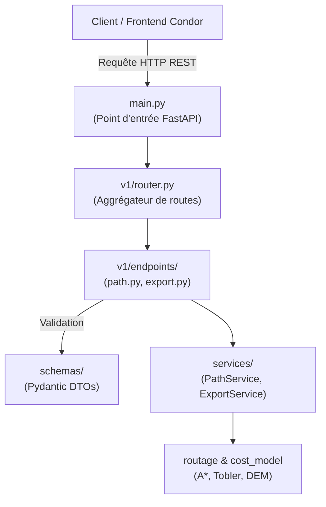
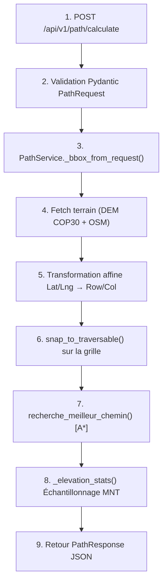
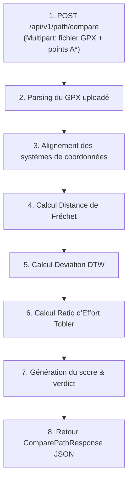
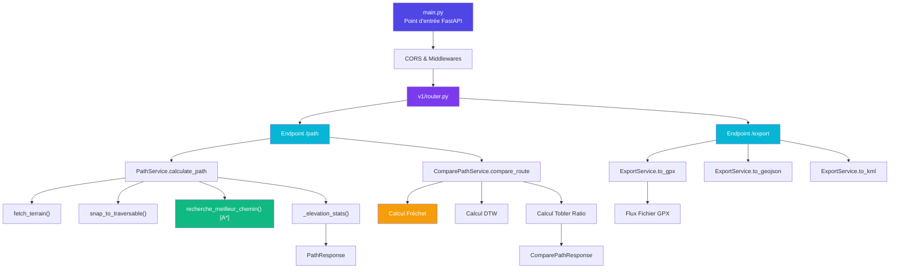

# Backend Condor - Manuel Technique

Le lien entre backend et le frontend de Condor est une API REST développée avec **FastAPI**, **Python 3.13** et **Pydantic**. Il fournit les services de calcul de trajectoires optimisées en terrain isolé (via algorithme A* et modèles de coût Tobler), la comparaison géométrique de tracés ainsi que l'exportation de données spatiales.

## Table des matières

- [Vue d'ensemble](#vue-densemble)
- [Architecture](#architecture)
  - [Flux de données backend](#flux-de-données-backend)
- [Stack technologique](#stack-technologique)
  - [Dépendances principales](#dépendances-principales)
  - [Outils de développement](#outils-de-développement)
  - [Accès à la documentation interactive](#accès-à-la-documentation-interactive)
  - [Commandes](#commandes)
    - [Lancer le serveur de développement avec rechargement automatique](#lancer-le-serveur-de-développement-avec-rechargement-automatique)
- [Structure du projet](#structure-du-projet)
- [Endpoints API (v1)](#endpoints-api-v1)
  - [path.py](#pathpy)
  - [export.py](#exportpy)
- [Services & Logique Métier](#services--logique-métier)
  - [PathService (path.py)](#pathservice-pathpy)
  - [ComparePathService (compare_path.py)](#comparepathservice-compare_pathpy)
  - [ExportService (export.py)](#exportservice-exportpy)
- [Schémas Pydantic (DTOs)](#schémas-pydantic-dtos)
  - [path.py](#pathpy-1)
  - [export.py](#exportpy-1)
- [Algorithmes & Modèles de Coût](#algorithmes--modèles-de-coût)
  - [Algorithme A* et Ancrage Grille](#algorithme-a-et-ancrage-grille)
  - [Métriques de Comparaison (Fréchet, DTW, Tobler)](#métriques-de-comparaison-fréchet-dtw-tobler)
- [Flux de données (Diagrammes)](#flux-de-données-diagrammes)
  - [Flux de calcul de trajectoire A*](#flux-de-calcul-de-trajectoire-a)
  - [Flux de comparaison de tracés](#flux-de-comparaison-de-tracés)
- [Pipeline Backend Condor](#pipeline-backend-condor)
  - [Résumé du pipeline backend](#résumé-du-pipeline-backend)
- [Bonnes pratiques de développement](#bonnes-pratiques-de-développement)
- [Dépannage](#dépannage)
  - [Erreur au démarrage du serveur](#erreur-au-démarrage-du-serveur)
  - [Erreur 422 Unprocessable Entity](#erreur-422-unprocessable-entity)
  - [Échec du routage (Fallback)](#échec-du-routage-fallback)

---

## Vue d'ensemble

L'API Condor constitue de ces éléments suivants :

- **Routage topographique optimisé** basé sur l'algorithme A* et les données altimétriques (DEM COP30).
- **Ancrage intelligent (`snap_to_traversable`)** garantissant un départ et une arrivée sur des zones franchissables.
- **Analyse comparative de tracés** calculant l'écart de Fréchet, la déviation DTW et le ratio d'effort Tobler par rapport aux fichiers GPX/CSV de référence.
- **Génération d'exports géospatiaux** multiformats (GPX, GeoJSON, KML).
- **Documentation OpenAPI/Swagger interactive** générée automatiquement.

---

## Architecture

L'application suit une architecture en couches (Layered Architecture) isolant la couche de routage, la validation Pydantic et la logique métier :



### Flux de données backend

- **Réception des requêtes** : Le routeur v1/router.py dirige la requête HTTP vers l'endpoint correspondant. 
- **Validation Pydantic** : Les données entrantes (ex: PathRequest) sont sérialisées et validées.
- **Exécution métier** : La couche services/ effectue le traitement spatial, la conversion matricielle et les calculs altimétriques.
- **Réponse structurée** : Un objet Pydantic de réponse (ex: PathResponse) est retourné sous forme de JSON au frontend.

## Stack technologique

### Dépendances principales

```Python
# SetUp/requirements.txt
fastapi
fastapi[standard]
uvicorn[standard]
geopy
gpxpy
similaritymeasures
```
### Outils de développement
* Uvicorn : Serveur ASGI à haute performance
* Pydantic : Validation et sérialisation des données
* FastAPI : Framework web moderne pour la création d'API RESTful
* Geopy : Calcul de distances géodésiques
* gpxpy : Lecture et écriture de fichiers GPX
* similaritymeasures : Calcul de métriques de similarité entre tracés

### Accès à la documentation interactive

L'API expose automatiquement une documentation Swagger interactive à l'adresse :

```URL
http://localhost:8000/docs
```

### Commandes
#### Lancer le serveur de développement avec rechargement automatique
```Bash
uvicorn api.main:app --reload --port 8000
```

## Structure du projet

```
api/
├── main.py                     # Instanciation FastAPI et middlewares CORS
├── README.md                   # Instructions rapides
├── schemas/                    # Schémas de validation Pydantic (DTOs)
│   ├── __init__.py
│   ├── export.py               # Types pour la génération d'exports (GPX, KML, GeoJSON)
│   └── path.py                 # Types pour le calcul et la comparaison de tracés
│
├── services/                   # Couche métier et algorithmique
│   ├── __init__.py
│   ├── path.py                 # Service principal de calcul A* et élévation
│   ├── compare_path.py         # Métriques de comparaison (Fréchet, DTW)
│   └── export.py               # Génération des fichiers GPX/GeoJSON/KML
│
└── v1/                         # Déclaration des endpoints API v1
    ├── __init__.py
    ├── router.py               # Aggrégateur des sous-routeurs
    └── endpoints/
        ├── __init__.py
        ├── path.py             # Routeur /api/v1/path
        └── export.py           # Routeur /api/v1/export
```

## Endpoints API (v1) 

tous les endpoints sont préfixés par `/api/v1/` et exposent des services RESTful pour le calcul de trajectoires, la comparaison de tracés et l'exportation de données géospatiales.

### path.py

* `POST /api/v1/path/calculate`
  * Description : Calcule l'itinéraire optimal A* en tenant compte du MNT (DEM COP30) et de la traversabilité.
  * Request Body : PathRequest
  * Response : PathResponse
  * Codes d'erreur : 400 Bad Request (BBox manquante), 422 Unprocessable Entity (Coordonnées hors zone).


* `POST /api/v1/path/compare`
  * Description : Compare la trajectoire calculée à une route issue d'un fichier GPX/KML uploadé.
  * Request Body : ComparePathRequest
  * Response : ComparePathResponse

### export.py

* `POST /api/v1/export/gpx`
  * Description : Exporte la trajectoire sous forme de document GPX.
  * Response : FileResponse / StreamingResponse (MIME application/gpx+xml)

* `POST /api/v1/export/geojson`
  * Description : Exporte la trajectoire en format GeoJSON FeatureCollection.
  * Response : JSON (MIME application/geo+json)


* `POST /api/v1/export/kml`
  * Description : Exporte la trajectoire pour affichage dans Google Earth.
  * Response : FileResponse (MIME application/vnd.google-earth.kml+xml)

## Services & Logique Métier

### PathService (path.py)

Gère l'intégration avec le fetcher de terrain, la conversion matricielle et l'exécution de l'A*.

```Python
class PathService:
    @staticmethod
    def calculate_path(data: PathRequest) -> PathResponse:
        """
        1. Valide et extrait la Bounding Box
        2. Extrait la grille de traversabilité OSM et la matrice MNT
        3. Convertit les coordonnées Lat/Lng en indices matrice (row, col)
        4. Exécute la recherche de chemin A*
        5. Évalue les statistiques d'élévation (max et moyenne)
        6. Retourne le PathResponse complet
        """
```

### ComparePathService (compare_path.py)

Calcule les écarts entre le chemin calculé et la trace de référence.

* `calculate_frechet_distance()`: Mesure la divergence maximale entre les deux courbes.
* `calculate_dtw_deviation()` : Aligne dynamiquement les séries temporelles/spatiales pour mesurer le décalage moyen.
* `calculate_tobler_ratio()` : Compare l'effort estimé en temps de marche selon la formule de Tobler.

### ExportService (export.py)

Génère les structures XML/JSON à la volée pour le téléchargement direct côté client.

## Schémas Pydantic (DTOs)

### path.py

```Python
class Coordinate(BaseModel):
    lat: float
    lng: float

class BBoxSchema(BaseModel):
    nord: float
    sud: float
    est: float
    ouest: float

class PathRequest(BaseModel):
    start: Coordinate
    end: Coordinate
    bbox: BBoxSchema

class PathResponse(BaseModel):
    trajectory_id: str
    start: Coordinate
    end: Coordinate
    bbox: BBoxSchema
    points: list[Coordinate]
    distance_km: float
    time: float
    grid_shape: tuple[int, int]
    grid_computed: bool
    max_elevation_m: float | None = None
    avg_elevation_m: float | None = None

# section pour la comparaison de tracés

class ComparisonMetrics(BaseModel):
    frechet_distance_meters: float
    dtw_corridor_deviation_meters: float
    tobler_effort_ratio: float

class ComparisonAnalysis(BaseModel):
    score: float
    verdict: str
    metrics: ComparisonMetrics

class RouteComparisonRequest(BaseModel):
    file: UploadFile = File(..., description="The uploaded GPX or CSV track"),
    bbox: str = Form(..., description="Stringified BBoxSchema JSON"),
    calculated_points: str = Form(..., description="Stringified list[Coordinate] JSON")

class RouteComparisonMetadata(BaseModel):
    bbox: BBoxSchema
    calculated_points: List[Coordinate]

class RouteComparisonResponse(BaseModel):
    trajectory_id: str
    distance_km: float
    estimated_time_minutes: float
    points: list[Coordinate]
    comparison: ComparisonAnalysis
```

### export.py

```Python
class ExportRequest(BaseModel):
    trajectory_id: str
    name_track: str
    start: Coordinate
    end: Coordinate
    points: list[Coordinate]
```

## Algorithme A* et Ancrage Grille

* Transformation Affine : Conversion des coordonnées $(\text{lat}, \text{lng}) \rightarrow (\text{row}, \text{col})$ via la matrice de transformation géospatiale du MNT.
* Ancrage (snap_to_traversable) : Si le point choisi tombe sur un obstacle non franchissable (ex: plan d'eau, falaise), l'algorithme recherche la cellule franchissable la plus proche dans la matrice osm_mult.
* Fonction de Coût Tobler : Le coût de déplacement entre deux cellules adjacentes intègre la pente :

$$W = 6 \cdot e^{-3.5 \cdot \vert{}\tan(\theta) + 0.05\vert{}}$$

Plus seront expliquées sur leurs spécifications techniques dans les documentations suivantes : 
* [Modèles de cout](docs/03-modeles-de-cout.md)
* [Routage](docs/04-routage.md)

## Métriques de Comparaison (Fréchet, DTW, Tobler)

* **Distance de Fréchet** : Quantifie la distance minimale nécessaire pour lier deux points se déplaçant le long des deux tracés.
* **Dynamic Time Warping (DTW)** : Corrèle les points des deux trajectoires même en présence de variations de vitesse ou de densité de points.
* **Score Global (0-100)** : Pondération agrégée combinant l'écart géométrique et le ratio d'effort physique.

## Flux de données (Diagrammes)

### Flux de calcul de trajectoire A*



### Flux de comparaison de tracés



## Pipeline Backend Condor



### Résumé du pipeline backend

1. **Point d'entrée** : `main.py` démarre l'application FastAPI, applique les règles CORS et charge le routeur `api_router`.
2. **Décodage & Validation** : Les contrôleurs FastAPI valident le format JSON d'entrée par rapport aux schémas Pydantic (`PathRequest`, `ExportRequest`).
3. **Calcul & Analyse** : `PathService` télécharge le MNT, applique l'algorithme A* matriciel et calcule le profil d'altitude.
4. **Exportation & Comparaison** : `ExportService` ou `ComparePathService` traitent les structures géométriques et génèrent la réponse finale (JSON ou binaire).

## Bonnes pratiques de développement

1. **Validation stricte** : Toujours typer les paramètres d'entrée et de sortie avec Pydantic.
2. **Gestion du Fallback** : Si l'algorithme A* échoue sur une zone invalide, capturer l'exception et retourner une ligne droite de secours (`Fallback line`).
3. **Optimisation NumPy** : Favoriser les opérations vectorisées NumPy pour la manipulation des grilles altimétriques.
4. **Indépendance des Services** : Conserver les services (`PathService`, `ExportService`) isolés de la couche HTTP FastAPI.

## Dépannage

### Erreur au démarrage du serveur

```Bash
ModuleNotFoundError: No module named 'api'
```
*  **Solution** : Lancez Uvicorn depuis la racine du projet en spécifiant le module complet :

```Bash
uvicorn api.main:app --reload --port 8000
```

### Erreur 422 Unprocessable Entity

* **Cause** : Le JSON de la requête ne respecte pas le schéma `PathRequest`.
* **Solution** : Vérifiez que les clés `start`, `end` et `bbox` (`nord`, `sud`, `est`, `ouest`) sont toutes présentes avec des types numériques (`float`).

### Échec du routage (Fallback)

* **Symptôme** : L'API retourne une trajectoire simple composée de 2 points (ligne droite).
* **Cause** : Le point de départ ou d'arrivée est situé en dehors des limites de la matrice MNT ou dans un plan d'eau non traversable.
* **Solution** : Ajustez les coordonnées ou élargissez la Bounding Box (`bbox`) dans la requête.
