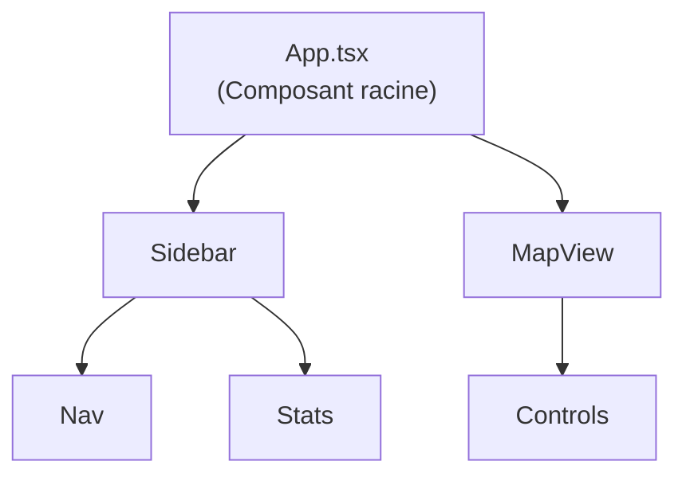
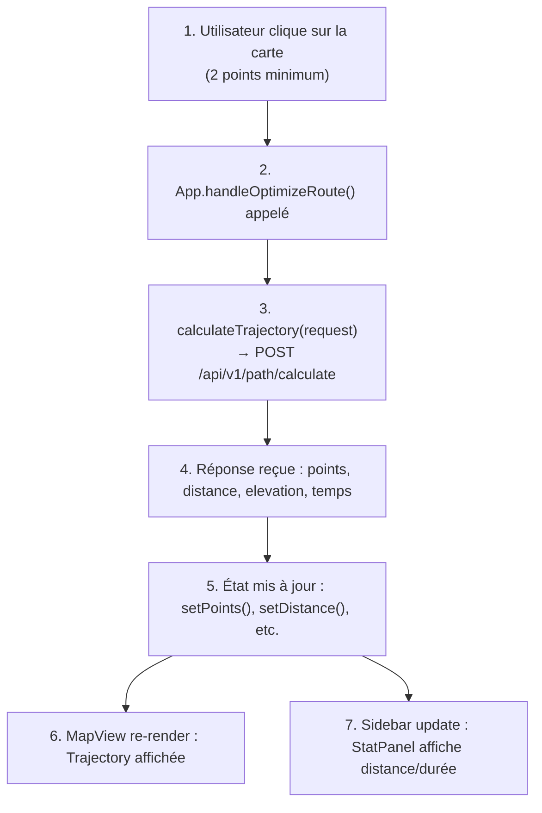
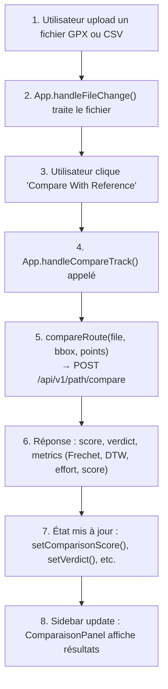
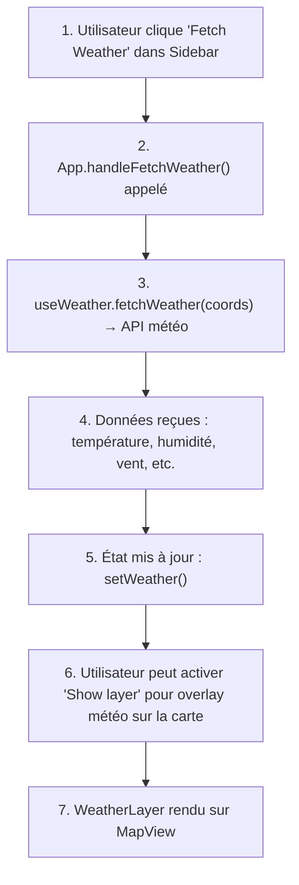
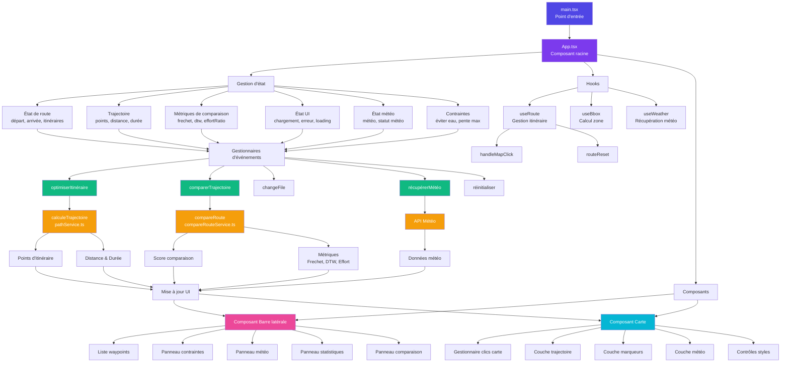

# Frontend Condor - Manuel Technique

Le frontend Condor est une application web interactive construite avec **React**, **TypeScript** et **Vite**, permettant aux utilisateurs de calculer des trajectoires optimisées en terrain isolé.

## Table des matières

- [Vue d'ensemble](#vue-densemble)
- [Architecture](#architecture)
  - [Flux de données](#flux-de-données)
- [Stack technologique](#stack-technologique)
  - [Dépendances principales](#dépendances-principales)
  - [Outils de développement](#outils-de-développement)
  - [Commandes](#commandes)
- [Structure du projet](#structure-du-projet)
- [Composants principaux](#composants-principaux)
  - [App.tsx](#apptsx)
  - [MapView.tsx](#mapviewtsx)
  - [Sidebar.tsx](#sidebartsx)
- [Hooks personnalisés](#hooks-personnalisés)
  - [useRoute](#useroute)
  - [useBBox](#usebbox)
  - [useWeather](#useweather)
  - [useWaypoints](#usewaypoints)
  - [useTrailFile](#usetrailfile)
  - [useExport](#useexport)
  - [useNaviguation](#usenaviguation)
- [Services API](#services-api)
  - [pathService.ts](#pathservicets)
  - [compareRouteService.ts](#comparerouteservicets)
  - [exportService.ts](#exportservicets)
- [Types TypeScript](#types-typescript)
  - [Types principaux](#types-principaux)
  - [Types additionnels](#types-additionnels)
- [Flux de données (Diagrammes)](#flux-de-données-1)
  - [Flux de calcul de trajectoire](#flux-de-calcul-de-trajectoire)
  - [Flux de comparaison de route](#flux-de-comparaison-de-route)
  - [Flux de chargement météo](#flux-de-chargement-météo)
- [Pipeline UI Condor](#pipeline-ui-condor)
  - [Résumé du pipeline UI](#résumé-du-pipeline-ui)
- [Interface utilisateur](#interface-utilisateur)
  - [Disposition générale](#disposition-générale)
  - [Sections du Sidebar](#sections-du-sidebar)
  - [Styles de carte](#styles-de-carte)
  - [Composants UI réutilisables](#composants-ui-réutilisables)
- [Responsive Design](#responsive-design)
- [Déploiement et optimisation](#déploiement-et-optimisation)
  - [Build](#build)
  - [Développement](#développement)
  - [Tests E2E](#tests-e2e)
- [Bonnes pratiques pour le développement dans frontend](#bonnes-pratiques-pour-le-développement-dans-frontend)
- [Intégration backend](#intégration-backend)
- [Dépannage](#dépannage)
  - [Application ne démarre pas](#application-ne-démarre-pas)
  - [Erreur API](#erreur-api)
  - [Carte ne s'affiche pas](#carte-ne-saffiche-pas)
  - [Performance lente](#performance-lente)

## Vue d'ensemble

Le frontend Condor offre une interface de planification d'itinéraires interactifs avec :

- **Carte interactive** basée sur Leaflet avec support de plusieurs styles
- **Calcul de trajectoires optimisées** minimisant l'effort de traversée
- **Comparaison de routes** avec des fichiers GPX/KML uploadés
- **Visualisation météorologique** intégrée
- **Export de trajectoires** en plusieurs formats
- **Système de coordonnées** MGRS (affichage seulement sur la carte) et lat/lng
- **Panneau latéral** configurable avec sections collapsibles

## Architecture

L'application suit une architecture composant-centrée avec séparation des préoccupations :



### Flux de données

1. **État global** : Géré via hooks personnalisés (`useRoute`, `useWeather`, `useBBox`)
2. **Événements utilisateur** : Clics sur la carte, input de coordonnées, uploads de fichiers
3. **Appels API** : Requêtes vers FastAPI (`/api/v1/path/*`, `/api/v1/export/*`)
4. **État local** : Gestion des états UI (chargement, erreurs, affichage)

## Stack technologique

### Dépendances principales

```json
{
  "react": "^19.2.5",
  "react-dom": "^19.2.5",
  "typescript": "~6.0.2",
  "vite": "^8.0.10",
  "leaflet": "^1.9.4",
  "react-leaflet": "^5.0.0",
  "@headlessui/react": "^2.2.10",
  "@heroicons/react": "^2.2.0",
  "tailwindcss": "^4.2.4",
  "axios": "^1.16.0"
}
```

### Outils de développement

- **Vite** : Bundler et dev server
- **TypeScript** : Type-checking
- **ESLint** : Linting du code
- **Prettier** : Formatage du code
- **Tailwind CSS** : Styling utilitaire
- **Cypress** : Tests E2E

### Commandes

```bash
npm run dev        # Lancer dev server (http://localhost:5173)
npm run build      # Build production
npm run lint       # Linter le code
npm run format     # Formater avec Prettier
npm run preview    # Préview build
```

## Structure du projet

```
src/frontend/condor/
├── src/
│   ├── api/
│   │   ├── pathService.ts           # Calcul de trajectoires
│   │   ├── compareRouteService.ts   # Comparaison de routes
│   │   └── exportService.ts         # Export du trajet
│   │
│   ├── components/
│   │   ├── map/
│   │   │   ├── MapView.tsx          # Conteneur carte principal
│   │   │   ├── MapClickHandler.tsx  # Gestion des clics sur la carte
│   │   │   ├── MapHint.tsx          # Infobulle interactive
│   │   │   ├── MapConfig.ts         # Configuration styles
│   │   │   ├── controls/
│   │   │   │   └── MapStyles.tsx    # Sélecteur de styles
│   │   │   └── layers/
│   │   │       ├── Trajectory.tsx   # Rendu de la route
│   │   │       ├── MarkerIcon.tsx   # Icônes personnalisées
│   │   │       └── WeatherLayer.tsx # Overlay météo
│   │   │
│   │   ├── sidebar/
│   │   │   ├── Sidebar.tsx          # Conteneur principal
│   │   │   ├── Navigation/
│   │   │   │   ├── CoordInput.tsx   # Input coordonnées
│   │   │   │   └── WaypointsList.tsx
│   │   │   ├── Stats/
│   │   │   │   └── StatPanel.tsx    # Distance, durée, élevation
│   │   │   ├── Compare/
│   │   │   │   └── ComparaisonPanel.tsx # Comparaison des routes

│   │   │   └── Meteo/
│   │   │       └── WeatherPanel.tsx # Affichage météo et overlay
│   │   │
│   │   └── ui/
│   │       ├── Alert.tsx            # Notifications
│   │       ├── Spinner.tsx          # Indicateur chargement
│   │       ├── Button.tsx
│   │       ├── Select.tsx           # Dropdown
│   │       ├── Dialog.tsx
│   │       ├── Branding.tsx         # Logo/Header
│   │       └── DataTableCard.tsx    # Tableaux de données
│   │
│   ├── hooks/
│   │   ├── useRoute.ts              # Gestion état route
│   │   ├── useBBox.ts               # Calcul bbox
│   │   ├── useWeather.ts            # Fetch météo
│   │   ├── useWaypoints.ts          # Gestion waypoints
│   │   ├── useNaviguation.ts        # Navigation/zoom
│   │   ├── useExport.ts             # Export routes
│   │   └── useTrailFile.ts          # Parsing GPX/KML
│   │
│   ├── types/
│   │   ├── Path.ts                  # Réponses API pathfinding
│   │   ├── Route*.ts                # États de route
│   │   ├── Coordinate.ts            # Coordonnées lat/lng
│   │   ├── Export.ts                # Types export (GPX, GeoJSON, KML)
│   │   ├── Weather.ts               # Types météo et overlay
│   │   ├── MapView.ts               # Types carte Leaflet
│   │   ├── Trajectory.ts            # Types rendu trajectoire
│   │   └── ...                      # 50+ fichiers de types
│   │
│   ├── utils/
│   │   └── geo.ts                   # Utilitaires géographiques
│   │
│   ├── App.tsx                      # Composant racine
│   ├── main.tsx                     # Point d'entrée
│   └── index.css
│
├── public/
│   ├── manifest.json
│   └── assets/
│
├── package.json
├── vite.config.ts
├── tsconfig.json
└── index.html
```

## Composants principaux

### App.tsx

**Responsabilités** :
- État global (start, end, waypoints, trajectoire)
- Orchestration des hooks personnalisés
- Racines de l'interface : MapView + Sidebar
- Orchestration des appels API
- Gestion des erreurs et du chargement
- Responsive design (sidebar mobile)

**Props principales** :
- `start` / `end` : Coordonnées de départ/arrivée (LatLng)
- `points` : Points de trajectoire calculés
- `isLoading` : Indicateur chargement global
- `error` : Message d'erreur affiché en Toast

### MapView.tsx

**Responsabilités** :
- Rendu Leaflet (la carte interactive)
- Gestion des clics utilisateur sur la carte (ajout de points)
- Affichage des marqueurs (départ, arrivée, waypoints)
- Overlays (météo, MGRS graticule)

**Structures clés** :
- `MapContainer` : Conteneur Leaflet
- `TileLayer` : Couches de base (plusieurs styles)
- `Marker` : Points départ/arrivée
- `Rectangle` : BBox de calcul
- `WeatherLayer` : Overlay météorologique

### Sidebar.tsx

**Responsabilités** :
- Interface utilisateur complète (panneau latéral)
- Sections collapsibles : Navigation, Stats, Comparaison, Météo
- Responsive design (mobile/desktop)
- Gestion des inputs utilisateur (coordonnées, waypoints, uploads)
- Affichage des résultats (distance, durée, métriques de comparaison)

**Sections intégrées** :
- `Navigation` : Input coordonnées, liste waypoints
- `StatPanel` : Distance, durée, élévation min/max
- `ComparaisonPanel` : Upload GPX, métriques de comparaison
- `WeatherPanel` : Fetch et affichage météo

## Hooks personnalisés

### useRoute

Gère l'état des points de route (départ, arrivée, waypoints intermédiaires).

```typescript
const {
  start,              // LatLng | null
  end,                // LatLng | null
  routeFeatures,      // LatLng[] (waypoints)
  allWaypoints,       // LatLng[] (start + features + end)
  status,             // "idle" | "loading" | "success" | "error"
  error,              // string | null
  handleMapClick,     // (coords: LatLng) => void
  reset,              // () => void
  updateStart,        // (lat, lng) => void
  updateEnd,          // (lat, lng) => void
  updateWaypoint,     // (index, lat, lng) => void
} = useRoute();
```

### useBBox

Calcule la bounding box à partir des points de route.

*Note: le show debug est activé par env dans le dossier condor.* 

```typescript
const {
  bbox,               // { nord, sud, est, ouest }
  leafletBounds,      // [[south, west], [north, east]]
  showDebugBox,       // boolean (affichage bbox sur carte)
} = useBBox(start, end);
```

### useWeather

Fetch données météorologiques (OpenWeatherMap/API)

```typescript
const {
  weather,            // WeatherData | null
  status,             // "idle" | "loading" | "success" | "error"
  error,              // string | null
  fetchWeather,       // (coords: LatLng) => Promise<void>
} = useWeather();
```

### useWaypoints

Gestion des waypoints personnalisés (legacy hook).

```typescript
const { waypoints, addWaypoint, removeWaypoint } = useWaypoints();
```

### useTrailFile

Parsing et gestion des fichiers GPX/KML uploadés.

```typescript
const {
  trailFeatures,      // GeoJSON features
  trailLoaded,        // boolean
  parseTrailFile,     // (file: File) => Promise<void>
} = useTrailFile();
```

### useExport

Gestion de l'export de trajectoires (GPX, GeoJSON, KML).

```typescript
const {
  exportData,         // Données formatées
  exportStatus,       // "idle" | "loading" | "success" | "error"
  handleExport,       // (format: ExportFormat) => Promise<void>
} = useExport(exportRequest);
```

### useNaviguation

Navigation et zoom sur la carte.

```typescript
const {
  zoomTo,             // (bounds: LatLngBounds) => void
  panTo,              // (coords: LatLng) => void
} = useNaviguation();
```

## Services API
 
Tous les services API sont regroupés dans le dossier `src/api/` et utilisent **Axios** pour les requêtes HTTP vers le backend FastAPI.

### pathService.ts

Calcule une trajectoire optimisée entre deux points.

```typescript
const response = await calculateTrajectory({
  start: { lat, lng },
  end: { lat, lng },
  bbox: { nord, sud, est, ouest },
});

// Réponse
{
  points: [{ lat, lng, elevation }, ...],
  distance_km: number,
  time: number,
  avg_elevation_m: number,
  max_elevation_m: number,
  trajectory_id: string,
}
```

**Endpoint** : `POST /api/v1/path/calculate`

### compareRouteService.ts

Compare une trajectoire calculée avec une route uploadée (GPX/KML).

```typescript
const response = await compareRoute(
  gpxFile,
  bbox,
  calculatedPoints
);

// Réponse
{
  comparison: {
    score: number (0-100),
    verdict: string,
    metrics: {
      frechet_distance_meters: number,
      dtw_corridor_deviation_meters: number,
      tobler_effort_ratio: number,
    }
  }
}
```

**Endpoint** : `POST /api/v1/path/compare`

### exportService.ts

Exporte une trajectoire en différents formats.

```typescript
const data = await exportRoute(trajectoryId, format);
// format: "gpx" | "geojson" | "kml"
```

**Endpoint** : `POST /api/v1/export/*`

## Types TypeScript

### Types principaux

**Coordinate** :
```typescript
type LatLng = [number, number]; // [latitude, longitude]
type Coordinate = { lat: number; lng: number };
```

**Path** :
```typescript
interface PathRequest {
  start: Coordinate;
  end: Coordinate;
  bbox: { nord: number; sud: number; est: number; ouest: number };
}

interface PathResponse {
  points: PathPoint[];
  distance_km: number;
  time: number;
  avg_elevation_m: number | null;
  max_elevation_m: number | null;
  trajectory_id: string;
}

interface PathPoint {
  lat: number;
  lng: number;
  elevation?: number;
}
```

**Export** :
```typescript
interface ExportRequest {
  trajectory_id: string;
  name_track: string;
  start: Coordinate;
  end: Coordinate;
  points: Coordinate[];
}

type ExportFormat = "gpx" | "geojson" | "kml";
```

**Weather** :
```typescript
interface WeatherData {
  temperature: number;
  humidity: number;
  windSpeed: number;
  condition: string;
  icon: string;
}

type WeatherLayerType = 
  | "precipitation_new"
  | "temperature"
  | "wind_speed"
  | "clouds";
```

**Route** :
```typescript
type RouteStatus = "idle" | "loading" | "success" | "error";
```

### Types additionnels

Voir le dossier `src/types/` pour :
- `Alert.ts`, `AlertVariants.ts` : Notifications
- `Comparison.ts`, `CompareRoute.ts` : Métriques comparaison
- `MapStyle.ts`, `MapView.ts` : Configuration carte
- `Trajectory.ts` : Rendu trajectoire
- Etc.

## Flux de données

### Flux de calcul de trajectoire



### Flux de comparaison de route



### Flux de chargement météo



## Pipeline UI Condor



### Résumé du pipeline UI

**Point d'entrée** → `main.tsx` initialise React et affiche `App.tsx`

**Couche état** → `App.tsx` gère :
- État de route (points de départ/arrivée)
- Données de trajectoire (points, distance, durée)
- Métriques de comparaison (Frechet, DTW, ratio d'effort)
- Météo et contraintes
- États de chargement/erreur UI

**Couche hooks** → Logique réutilisable :
- `useRoute` - gère la sélection d'itinéraire
- `useBbox` - calcule la zone délimitée
- `useWeather` - récupère les données météo

**Couche composants** → Deux conteneurs principaux :
- **Barre latérale** - contrôles UI, statistiques, comparaisons
- **Carte** - carte interactive avec couches

**Gestionnaires d'événements** → Déclenchés par actions utilisateur :
- Optimisation itinéraire → appel API → mise à jour points
- Comparaison trajectoire → appel API → mise à jour métriques
- Récupération météo → appel API → mise à jour couche
- Réinitialisation → efface tous les états

**Couche API** → Services backend :
- `pathService.ts` - calcul d'itinéraire
- `compareRouteService.ts` - comparaison de trajectoire
- API Météo - données météorologiques

**Affichage** → L'état mis à jour revient aux composants pour l'actualisation UI

## Interface utilisateur

### Disposition générale

Desktop : **Carte principale** à droite, **Sidebar** à gauche.
Mobile/petit écran : Sidebar collapsible, carte pleine largeur.


### Sections du Sidebar

**Navigation** :
- Input de coordonnées (lat/lng)
- Bouton "Optimize Route"

**Stats** :
- Distance (km)
- Durée estimée (h)
- Élévation min/max

**Comparaison** :
- Upload de fichier GPX/CSV
- Affichage du fichier importé
- Bouton "Compare With Reference"
- Affichage des métriques (Frechet, DTW, effort ratio ,score)

**Météo** :
- Bouton "Fetch Weather"
- Toggle "Show overlay"
- Affichage des conditions actuelles
- Sélecteur type overlay (précipitations, température, vent)
- Slider opacité de l'overlay

### Styles de carte

Configuration dans `MapConfig.ts` :
- `topographic` : Carte topographique (par défaut)
- `satellite` : Imagerie satellite
- `street` : Plan urbain

Styles personnalisés en Tailwind CSS :
- **Thème** : Fond `bg-slate-950`, texte `text-slate-200 ou white`
- **Couleurs points** : Accent jaune ( waypoints), bleu (départ), rouge (arrivée)
- **Animations** : Icônes de pulse, transitions smooth

### Composants UI réutilisables

**Alert.tsx** :
```typescript
<Alert 
  type="error" | "success" | "info" | "warning"
  message={string}
  autoClose={boolean} 
/>
```

**Spinner.tsx** :
```typescript
<Spinner /> // Indicateur chargement au centre écran
```

**Select.tsx** :
```typescript
<Select
  value={string}
  onChange={(value) => {}}
  options={SelectOption[]}
/>
```

**DataTableCard.tsx** :
```typescript
<DataTableCard
  title={string}
  data={Record<string, string | number>}
/>
```

## Responsive Design

**Breakpoints Tailwind** :
- `sm` (640px), `md` (768px), `lg` (1024px), `xl` (1280px)

**Adaptations** :
- **Mobile** : Sidebar cachée par défaut, toggle hamburger visible
- **Tablet** : Sidebar réduite, contrôles retaillés
- **Desktop** : Sidebar toujours visible

## Déploiement et optimisation

### Build

```bash
npm run build
```

Génère dossier `dist/` optimisé pour production.

**Optimisations Vite** :
- Code splitting automatique
- Tree-shaking
- Minification
- Lazy loading de composants

### Développement

```bash
npm run dev
```

- HMR (Hot Module Replacement) activé
- Source maps pour debug
- TypeScript checking en direct

### Tests E2E

```bash
npm run test:e2e
```

Tests Cypress pour validation de l'interface.

## Bonnes pratiques pour le développement dans frontend

1. **Types TypeScript** : Utiliser les types définis dans `src/types/`
2. **Composants** : Garder les composants petits et modulaires
3. **Hooks** : Utiliser les hooks personnalisés pour la logique réutilisable
4. **Styling** : Préférer Tailwind CSS aux styles inline
5. **Performance** : Utiliser `useMemo` et `useCallback` pour l'optimisation
6. **Erreurs** : Toujours afficher les erreurs utilisateur via Alert ou via l'input lié à l'erreur 

## Intégration backend

Le frontend communique avec FastAPI via :

**URLs de base** : `/api/v1/`

**Endpoints utilisés** :
- `POST /api/v1/path/calculate` : Calcul trajectoire
- `POST /api/v1/path/compare` : Comparaison routes
- `POST /api/v1/export/gpx` : Export GPX
- `POST /api/v1/export/geojson` : Export GeoJSON
- `POST /api/v1/export/kml` : Export KML

**CORS** : Frontend et backend doivent être configurés pour CORS.

## Dépannage

### Application ne démarre pas

```bash
# Vérifier node_modules
npm install

# Effacer cache Vite
rm -rf .vite

# Lancer dev server
npm run dev
```

### Erreur API

Vérifier dans la console du navigateur (DevTools) :
- Status HTTP (200, 404, 422, 500)
- Message d'erreur du backend
- Présence du header `Content-Type: application/json`

### Carte ne s'affiche pas

- Vérifier que Leaflet CSS est importé
- Vérifier que MapContainer a une hauteur définie
- Vérifier que les tokens API (tuiles) sont valides

### Performance lente

- Profiler avec Chrome DevTools (Lighthouse)
- Vérifier state updates excessifs
- Optimiser re-renders avec React DevTools Profiler
- Réduire taille fichiers uploadés (GPX)
