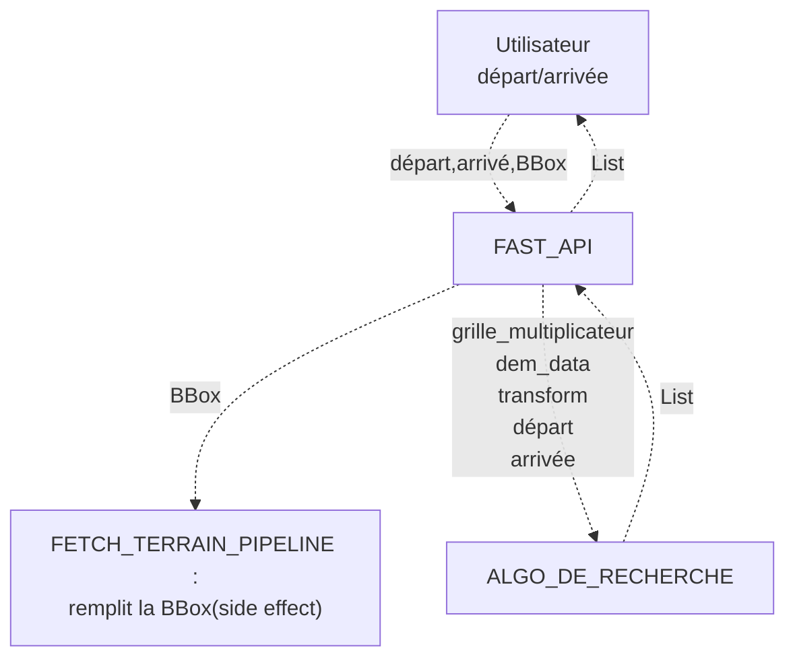
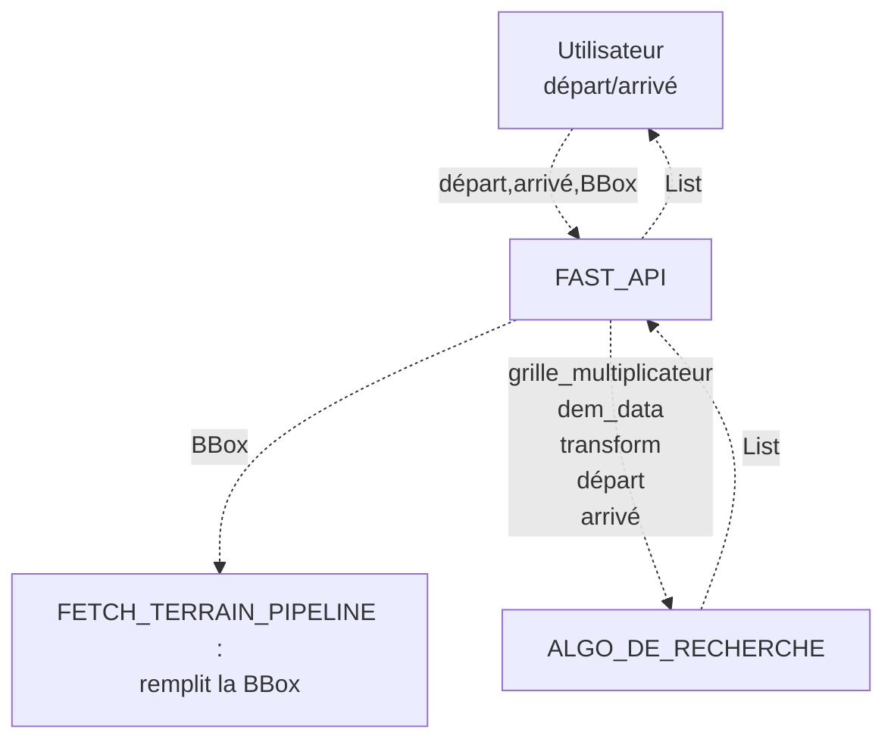

# Projet Condor - Manuel Technique

Documentation du fonctionnement interne de projet Condor

## Table des matières
- [Préface](#préface)
- [Architecture](01-architecture.md)
- [données terrain](02-donnees-terrain.md)
- [modeles de cout](03-modeles-de-cout.md)
- [routage](04-routage.md)
- [api](05-api.md)
- [frontend](06-frontend.md)

## Préface

**Contexte du projet :** **Projet Condor** est un ***planificateur d'itinéraires*** en terrain isolé ou non balisé.
À l'instar des outils grand public tel que *allTrails, Google Maps, Strava... et autres* **Projet Condor** construit son propre modèle de coût de déplacement **directement** calculé à partir de données ***Open Source*** brutes du territoire.

Les **sources** suivantes sont utilisées pour modéliser le terrain :  
* **DEM** *digital elevation model* : OpenTopography GlobalDataSets API (https://opentopography.org/developers)
*  **Hydrographie** : OpenStreetMap OverPass API
* **réseau routier** : OpenstreetMap OverPass API
* **Détails sur l'environnement** : OpenStreetMap OverPass API

Le prototype calcule le chemin qui **minimise l'effort de traversée** entre 2 points géographiques. 
Ce modèle se base sur ***Tobler's hiking function***, un système de **multiplicateurs de terrain**,
une **pénalité d'altitude** dérivée de la *loi de Dalton*, et des **algorithmes de recherche** dans un graphe.

## Description du pipeline

1. L'utilisateur choisit un point de départ et un point d'arrivée. 

    -> src/frontend/condor

2. Le FAST API reçoit la requête. 

    -> src/api/v1/endpoints/path.py + src/api/services/path.py::PathService.calculate_path

3. Le pipeline de fetch_terrain acquiert les données terrain. 

    ->  src/data/data_fetcher.py::fetch_terrain, remplit la bbox en place. 

4. La grille des multiplicateurs est construite. 

    -> cost_model/cost_grid.py::build_multiplicateurs_osm + cost_model/weights.py 

5. Algo de recherche trouve un chemin d'effort minimal 

    -> src/routage/a_star.py::recherche_meilleur_chemin (+ simplification routage/simplify.py::simplifier_rdp)

6. retour du tracé et affichage 

    -> PathResponse +  src/api/schemas/path.py

### Schéma du pipeline

## Organisation du code

- Projet/src/
    - api/
        - schemas/
            - export.py
            - path.py
        - services/
            - compare_path.py
            - export.py
            - grid_export.py
            - path.py
        - v1/
            - endpoints/
                - export.py
                - grid.py
                - path.py
            - router.py
        - main.py
    - cost_model/
        - cost_grid.py
        - physique.py
        - weights.py
    - data/
        - Elevation/
            - client_opentopography.py
            - parser_elevation.py
            - structures_elevation.py
        - OverPass/
            - client_overpass.py
            - queries_overpass.py
            - raster_overpass.py
            - search_overpass_raster.py
            - structures_op.py
        - data_fetcher.py
        - disk_cache.py
        - structures_communes.py
    - frontend/
        - condor/
        - React-Leaflet-MGRS-Graticule/
        - src/ 
    - routage/
        - a_star.py
        - simplify.py

## Description du pipeline

1. L'utilisateur choisi un point de départ et un point d'arrivé.
2. Le FAST API reçoit la requête.
3. Le pipeline de fetch_terrain acquiert les données terrain.
4. La grille des multiplicateurs est construite.
5. Algo de recherhce trouve un chemin d'effort minimal
6. retour du tracé et affichage

