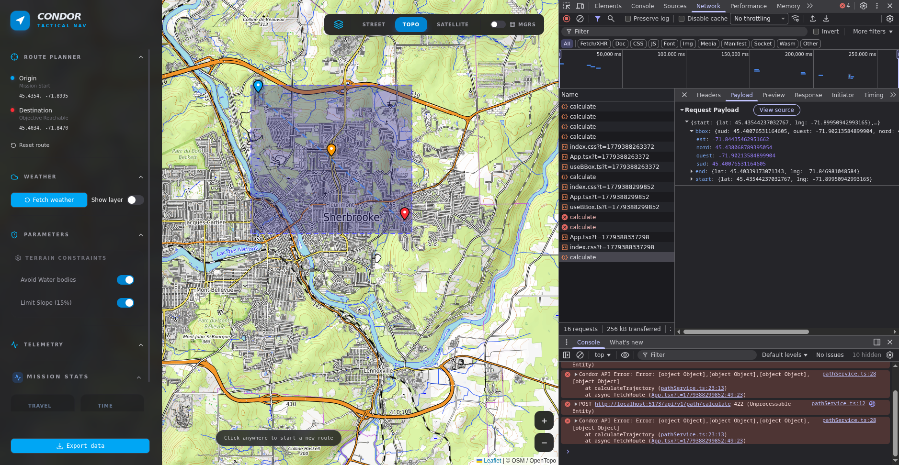

# Frontend

## Description 

Ce dossier contient tous ce qui est relier au frontend.
Le  code ce retrouver dans `condor/src` 

## Dépendances

- Node.js: version 24 LTS ou +
- npm 


## Démarrage rapide
### Installation des modules :

```Bash
npm install
```
### Setup de l'environnement de développement :
```Bash
cp .env.example .env
```

### Lancement du serveur de développement :
```
Bash
npm run dev
```
### Build pour la production :
```
Bash
npm run build
```

## Structure du Code (`condor/src`)

| Dossier           | Description                                                                               |
|:------------------|:------------------------------------------------------------------------------------------|
| **`api/`**        | Services de données. Tous ce qui va faire les call api du frontend                        |
| **`components/`** | Éléments d'interface (Sidebar, MapStyleSwitcher, MapHint).                                |
| **`hooks/`**      | Logique métier réutilisable (Calcul de distance, gestion des points). AKA les reacts hook |
| **`types/`**      | interface pour le code et les types TypeScript                                            |


## Set Boundary Box in UI 

dans le .env mettre `VITE_SHOW_DEBUG_BBOX=true `
et lorsqu'un point de départ et d'arrivé sont sélectionné, une bbox va être affiché sur la map pour aider au debug de la partie backend.
